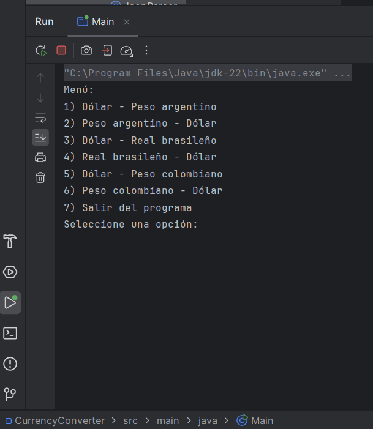
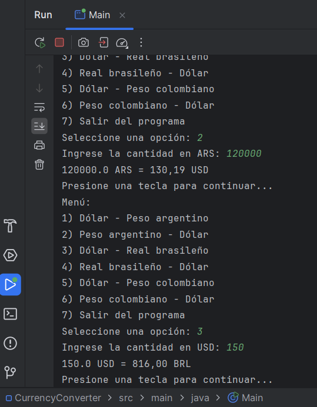

# Currency Converter

## Descripción

Currency Converter es una aplicación Java que permite convertir entre diferentes monedas usando las tasas de cambio actuales obtenidas de una API. La aplicación soporta las siguientes conversiones:

- Dólar a Peso argentino
- Peso argentino a Dólar
- Dólar a Real brasileño
- Real brasileño a Dólar
- Dólar a Peso colombiano
- Peso colombiano a Dólar

## Funcionalidades

- Conversión de monedas utilizando tasas de cambio actuales.
- Interfaz de usuario en español.
- Formato de salida con dos decimales.
- Menú interactivo que permite seleccionar la conversión deseada.
- Solicitud al usuario de pulsar una tecla para continuar después de cada conversión.

## Requisitos

- Java 8 o superior
- Maven

## Instalación

1. Clona este repositorio:

    ```bash
    git clone https://github.com/zuckonit23/currency-converter.git
    ```

2. Navega al directorio del proyecto:

    ```bash
    cd currency-converter
    ```

3. Compila el proyecto usando Maven:

    ```bash
    mvn clean install
    ```

## Uso

1. Ejecuta la aplicación:

    ```bash
    mvn exec:java -Dexec.mainClass="Main"
    ```

2. Sigue las instrucciones en pantalla para seleccionar la conversión deseada y proporciona la cantidad a convertir.

## Capturas de Pantalla

### Menú Principal



### Ejemplo de Conversión 1


### Ejemplo de Conversión 2



## Dependencias

- [Apache HttpClient](https://hc.apache.org/httpcomponents-client-4.5.x/index.html)
- [Jackson Databind](https://github.com/FasterXML/jackson-databind)

## Créditos

Este proyecto fue desarrollado como parte de un desafío de programación. ¡Gracias por tu interés!
